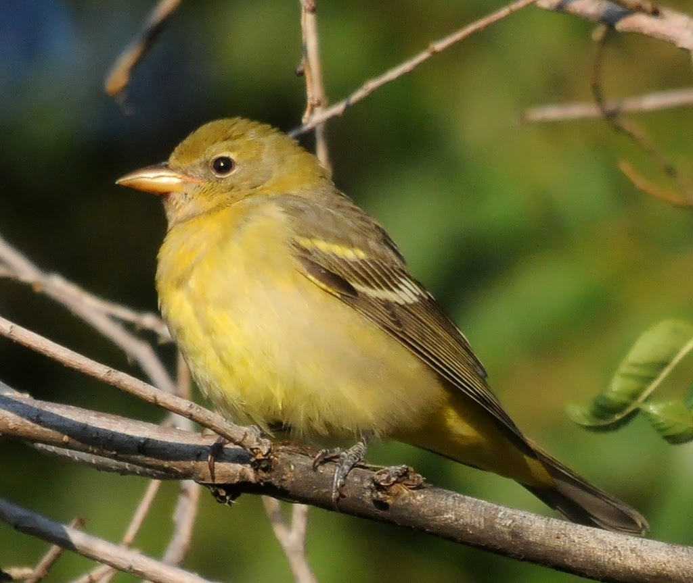
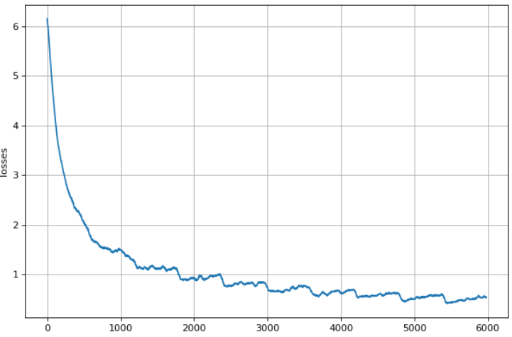
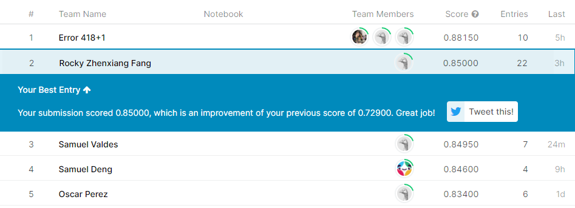

## Archery-Cloth Simulation
  

### Video
<video src="./video.mov" width="320" height="200" controls preload></video>
### Description
We were doing image recognition of vehicles and using the data from Kaggle and Cifar. This recognition includes convolutional neural networks in pytorch. However, once the professor announced the bird classification challenge, we understood that we can use the same skill for classifying different types of birds. We can use a neural network to train the bird dataset with up to 38562 images in it and see how accurate our model is. In addition to our accuracy, we also can compete with others training accuracy in Kaggle. This can help us to think about how to improve our model, including changing the number of epochs or the size of learning rate.  

### Methodology

**Platform and tool**:
We decide to use colab as our developing platform since it is more convenient for a team project. Colab also provides online GPUs computation from Google. We can use those GPUs with cuda computation for training models and accelerating computational speed. In addition to the online platform, the programming tool we used in this project is Pytorch. Pytorch supports several computational functions in the neural network. We can design our own neural network and train the model in Pytorch. It also supports cuda computation in GPU. We can use the GPU in colab with Pytorch to train the model and accelerate computation speed. 
  
**Data preprocessing**:

After having a preliminary check on the dataset, we found that the dataset is large, and downloading it every time from the internet will take a lot of time, while the training time is also affected. Thus, we preprocessed the images, including downsizing the image, convert the JPG file into an H5 file, and load all the images into RAM in the beginning, before training.

* #### Downsizing the image and convert file:

The dataset comes with various sizes of images which makes the dataloader needs to resize the image every time.  To deal with this problem, we decided to resize the images locally before uploading them to collab. By doing this the dataloader does not have to adjust the image size every time an image is loaded. Also, as suggested by the instructor, using the H5 format will be faster than JPG, thus, we convert the JPG file to H5 using NumPy and h5py. After these two processes, the new files are uploaded and used as the training data. The code can be found at[https://github.com/JingC123/CSE455_Project/blob/main/code/Preprocess.py](https://github.com/JingC123/CSE455_Project/blob/main/code/Preprocess.py).

### Results
The training plan we used in the end is:  
Resnet101 pretrained model with total 20 epochs.  
1. In the first 15 epochs, we set the lr = 0.01 and decay = 0.0005.
2. The next 5 epochs, we set the lr=0.001 and decay remains the same.
  

  

In the end, the score we got is 0.85, and we are 2nd in the competition :)

### Expectation
While we can receive a relatively accurate model, there are still places to improve. First, the data converting process does cannot be applied to the final model due to hardware limitations. If the images are resized to 256\*256, the size of the dataset will be too big to store in Google Drive or to load into RAM directly. Second, the size of images can be larger if we have more VRAM. Finally, since we now have a more complicated data input, we assume that using a more complicated model might improve the result more than what we tested in small images.   

